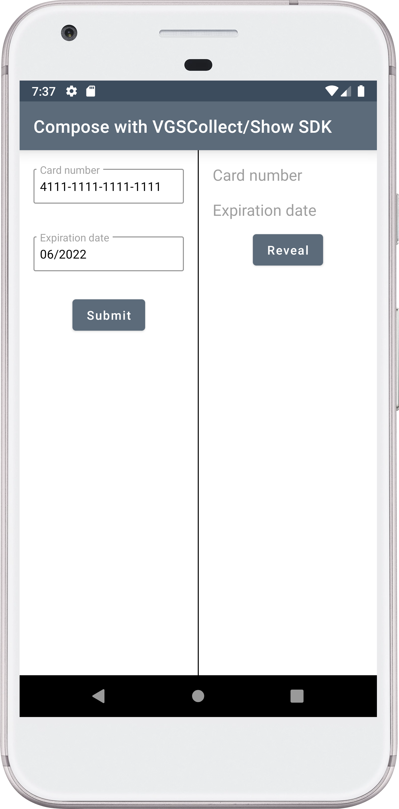
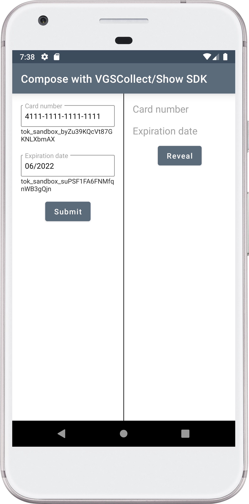
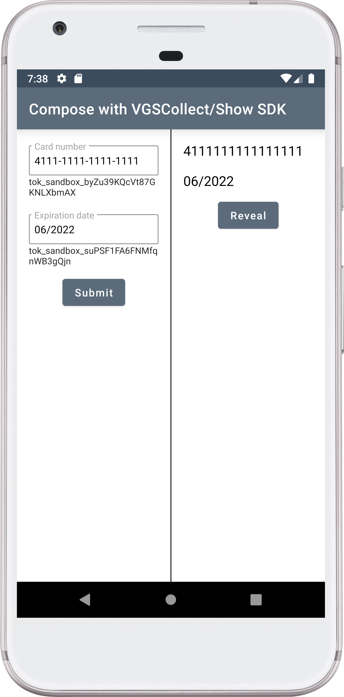

# VGS Collect/Show SDK with Jeptack Compose

This examples shows how easily you can integrate VGS Collect/Show SDKs with Jetpack Compose.

        
    
         

## How to run it?

### Requirements

- Installed version of <a href="https://developer.android.com/studio/preview" target="_blank">Android Studio Canary</a>
- Installed <a href="https://developer.android.com/studio/run/emulator" target="_blank">emulator</a>
- Organization with <a href="https://www.verygoodsecurity.com/">VGS</a>

#### Step 1

Go to your <a href="https://dashboard.verygoodsecurity.com/" target="_blank">VGS organization</a> and establish <a href="https://www.verygoodsecurity.com/docs/getting-started/quick-integration#securing-inbound-connection" target="_blank">Inbound connection</a>. For this demo you can import pre-built route configuration:

-  Find the **configuration.yaml** file inside the app repository and download it.
-  Go to the **Routes** section on the <a href="https://dashboard.verygoodsecurity.com/" target="_blank">Dashboard</a> page and select the **Inbound** tab.
-  Press **Manage** button at the right corner and select **Import YAML file**.
-  Choose **configuration.yaml** file that you just downloaded and tap on **Save** button to save the route.

#### Step 2

Clone demo application repository.

``git clone git@github.com:verygoodsecurity/vgs-collect-show-android-jetpack-compose-demo.git``

#### Step 3

Setup `"<VAULT_ID>"`.

Find `CollectAndShowActivity.kt` in package and replace `<VAULT_ID>` with your <a href="https://www.verygoodsecurity.com/docs/terminology/nomenclature#vault" target="_blank">vault id</a>.

#### Step 4

Run the application.

#### Step 5

Submit and reveal the form then go to the Logs tab on a Dashboard find a request and secure a payload.
Instruction for this step you can find <a href="https://www.verygoodsecurity.com/docs/getting-started/quick-integration#securing-inbound-connection" target="_blank">here</a>.
